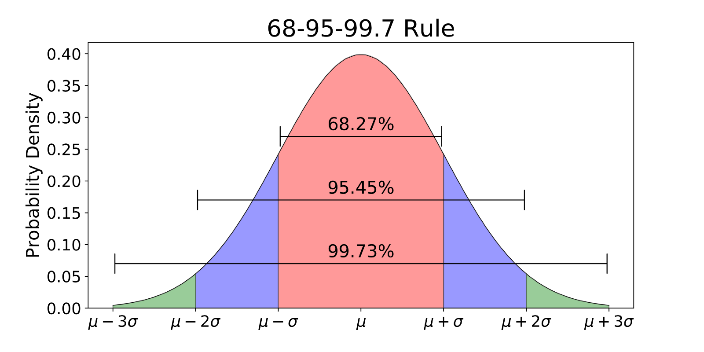

QRM: Third Meeting 

Research Methodology in Social Sciences
========================================================
author: Dr. David Sichinava
date: October 19, 2018
autosize: true
transition: none
css: css/style.css
font-family: 'BPG_upper'
Third Meeting

Today's meeting
========================================================

- Probability distributions
- Lab

Introduction to probability
========================================================

- How do we unedrstand probability?
	- Frequentist approach
	- Bayesian approach
- Why do we need probabilities?

Introduction to probability
========================================================
- Through this class, we will use _frequentist_ understanding of probability, that is:
	+ "the proportion of times the outcome would occur in a very long sequence of observations"
	+ Usually, probabilities are expressed in numbers between 0 and 1, or - in percentages.

Introduction to probability
========================================================
Probability has many properties, although the following are the most important (for us):

+ $P(not A)= 1- P(A)$
+ $P(A or B) = P(A) + P(B)$
+ $P(A and B) = P(A)*P(B)$

Introduction to probability
========================================================

Random variables
========================================================
* Let's imagine that we are doing an experiment or drawing a sample from population;
* Each possible outcome of the variable has a certain probability of occuring
* We call these variables _random variables_
* Set of these possible outcomes is called _probability distribution_. Based on probability theory (and math) we can estimate these values.

Discrete and continuous (random) variables
========================================================

Discrete and continuous (random) variables
========================================================

Parameters describing probability distributions
====================================
- Probability distributions have formulas for calulating probabilities:
	+ Mean, measuring the _expected value_ of a distribution,
	+ Standard deviation, measuring the _spread_ of a distribution

Normal distribution
========================================================

Normal distribution
========================================================
- In normal distribution, the probability of $\mu$ within any particular number of $\sigma$ standard deviations is the same (0.68 for one $\sigma$, 0.95 for two $\sigma$ and 0.997 for three $\sigma$)
- For normal distribution, for each value of $z$, the probability of falling within $z$ standard deviation from the mean depends on the value of $z$. For instance, the value of two standard deviations above the mean has z-value of 2.00
- Put it simply, $z$-score is the number of standard deviations from the mean
- It is an useful way of calculating a probability of a particular value in the distribution (and comparing it to other groups)
- $z=(y-\mu)/\sigma$

Sampling distribution
========================================================
- We rarely have complete data and rely on _samples_
- Sampling distribution of a statistic is the probability distribution that specifies probabilities for the possible values that statistic can take
- That is, we take _many samples_ from population, and then calculate the value of sample statistics
- The sampling distribution of the sample mean $\hat\y$ centers around population mean. Standard deviation, or _standard error_ relates to the population $\sigma$ by $\sigma_{y}=\sigma/\sqrt{n}$.
	+ What will happen, if we increase n?

Ta-daam! Central Limit Theorem
========================================================
- For large random samples, the sampling distribution of the sample mean is approximately normal. This holds no matter what the shape of the population is.
- It's one of the foundational principles of frequentist statistical inference

====================================

