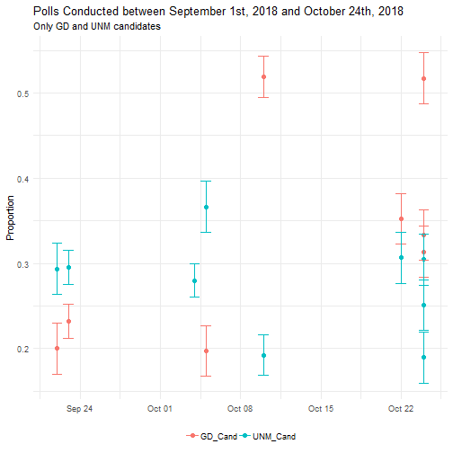

QRM: Fourth Meeting 

Research Methodology in Social Sciences
========================================================
author: Dr. David Sichinava
date: October 26, 2018
autosize: true
transition: none
css: css/style.css
font-family: 'BPG_upper'
Fourth Meeting

Today's meeting
========================================================

- Estimation
- Lab

Parameter vs. Estimate
========================================================

Parameter vs. Estimate
========================================================

- Very often, we have to infer about population based on relatively small number of observations (_sample_)
- For instance, usually in the media polls are covered as _parameters_ but they are _estimates_

Biased and Unbiased Estimates
========================================================
- A good estimate has a sampling distribution which is centered around the parameter and has small standard error

Confidence Interval
========================================================
- We are _never_ sure how precise are our estimates, therefore it is _safer_ to assume a particular margin that contains true population parameter by a high probability, say - close to 1
- This margin is called _confidence interval_. Confidence interval has a form: Point Estimate +/- margin of error (multiple of a standard error)
- Confidence intervals are chosen conventionally, usually, 95% or 99%

Confidence Interval for Proportion and Mean
========================================================
- $\sigma_{\hat{\pi}} = {\sigma}/{n} = \sqrt{{\pi(1-\pi)}/{n}}$

- $\sigma_{\hat{x}} = {s}/{\sqrt{n}}$

Confidence Interval for Proportion and Mean
========================================================

Sample size
========================================================
- $n  = {\sigma}^2 * ({z}/M)$

====================================

