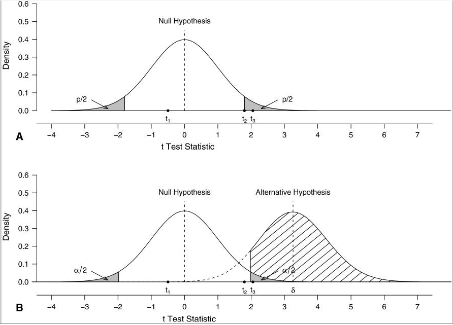

QRM: Fifth Meeting 

Research Methodology in Social Sciences
========================================================
author: Dr. David Sichinava
date: November 9, 2018
autosize: true
transition: none
css: css/style.css
font-family: 'BPG_upper'
Fifth Meeting

Today's meeting
========================================================

- Significance tests
- Lab

What is hypothesis?
========================================================
> A hypothesis is a statement about a population, it is usually a prediction that a parameter takes a particular value, or falls in a certain range of values

Assumptions for hypothesis testing
========================================================
* Type of data
* Randomization
	+ Data were obtained using random sample
* Population distribution
	+ For some tests, variables should have specific distribution (e.g., normal, or other known type of distribution)
* Sample size
	+ For large sample size, the validity of many tests increases
	
Null hypothesis
========================================================
* Null hypothesis($H_{0}$) is a statement that the parameter takes a particular value; the Alternative hypothesis ($H_{a}$) states that the parameter takes an alternative range of values;
* Note that often null hypothesis implies no effect; but this is not a _necessary condition_
* How do we evaluate whether to accept or reject null hypothesis?

Some background...
========================================================
* Two methods of evaluating your hypothesis
* Fisher's approach evaluated whether it is possible the observed data to occur if null hypothesis was true. Imagine that we did an experiment and obtained some values for our variable of interest. While null hypothesis states that there's a no effect, we can easily calculate a test statistic measuring the difference between what is observed and the null hypothesis and then convert it to a probability;
* Oh, and Test Statistic is a value (usually, the number of standard errors) which summarizes how far the estimate is from the parameter

Some background...
========================================================
* I mentioned a probability, or a _P-value_ which quantifies how unusual the observed test statistic is compared to what $H_{0}$ predicts
* In other words, P-value is the probability that the test statistic euqals the observed value or a value more extreme in the direction predicted by $H_{a}$. 
* A small P-value indicates that if $H_{0}$ were true, observed data would be _unusual_, that is, smaller P-value indicates the evidence _against_ $H_{0}$

Some background...
========================================================

Some background...
========================================================
* Another approach first elaborated by Neyman and Pearson states that one couldn't have a null hypothesis if there has not been any alternatives

| Result |Rejecting $H_{0}$ | Retaining $H_{0}$ |
|--------|-----------|------------------|-------------------|
| $H_{0}$ True | Type I error | True        |
| $H_{0}$ False    | True       | Type II error |

Some background...
========================================================
* In Neyman-Pearson's approach, we assess the probability of false negative (failing to detect an effect when there's no effect)
* As you might see, there's a lot of room for confusion between the two approaches

Some background...
========================================================

| Fisher’s p value                                                     | Hypothesis testing                                             |
|----------------------------------------------------------------------|----------------------------------------------------------------|
| Ronald Fisher                                                        | Jerzy Neyman and Egon Pearson                                  |
| Significance test                                                    | Hypothesis test                                                |
| p Value                                                              | α                                                              |
| The p value is a measure of the evidence against the null hypothesis | α and β levels provide rules to limit the proportion of errors |
| Computed a posteriori from the data observed                         | Determined a priori at some specified level                    |
| Applies to any single experiment                                     | Applies in the long run through the repetition of experiments  |
| Subjective decision                                                  | Objective behavior                                             |
| Evidential, ie, based on the evidence observed                       | Nonevidential, ie, based on a rule of behavior                 |

source: Biau et al, 2010

One-sided and two-sided tests
========================================================

* $H_{0}: \mu-\mu_{0}=0$ - here we look whether the two values simply _differ_ from each other
* Alternatively, we might seek to assess the _direction_ of relationship

 
α-level
========================================================
> The α-level, or a significance level is a number such that we reject the $H_{0}$ if the P-value is less than or euqal to it. For convenience, we use 0.05 or 0.01

α-level
========================================================
> Little p-value 
What are you trying to say 
Of significance?

— Stephen Ziliak,

